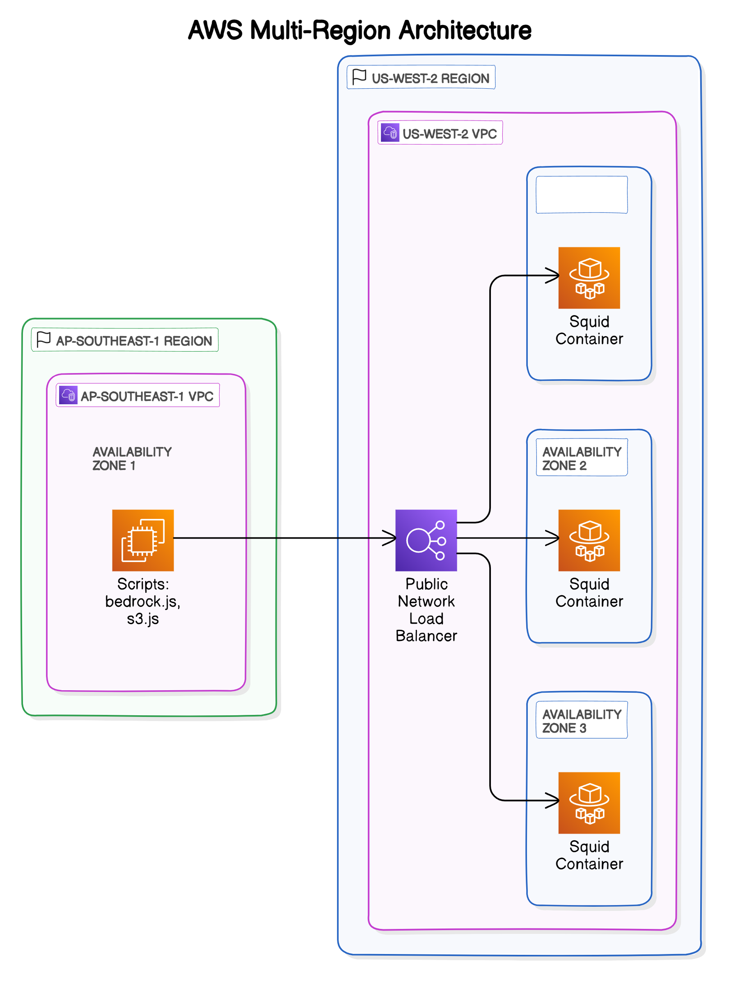

# AWS Squid Proxy CDK Project

This project deploys a Squid proxy on AWS ECS Fargate with a Network Load Balancer using AWS CDK. Invoke AWS SDK via this proxy.

## Architecture

This solution deploys a Squid proxy server on AWS ECS Fargate behind a Network Load Balancer. The architecture enables secure outbound connections to AWS services through a centralized proxy from another region.



Key components:

- VPC with configurable CIDR and Availability Zones
- ECS Cluster running on Fargate
- Squid Proxy containers (Ubuntu/Squid)
- Network Load Balancer (public or private)
- Security Groups for access control
- NAT Gateway for outbound internet access

The flow:

1. AWS SDK clients connect to the Network Load Balancer
2. Traffic is distributed across Squid proxy containers
3. Proxy containers handle outbound requests to AWS services
4. Responses return through the same path

## Prerequisites

- AWS CLI installed and configured
- Node.js 14.x or later
- AWS CDK CLI installed (`npm install -g aws-cdk`)

If you haven't used AWS CDK before, please follow the [AWS CDK Getting Started Guide](https://docs.aws.amazon.com/cdk/v2/guide/getting_started.html) first.

## Installation

1. Clone this repository
2. Install dependencies:

```bash
cd proxy
npm install
```

## Configuration

The stack can be configured through the `cdk.json` file in the `context` section under `proxy-config`:

### VPC Configuration

```json
{
  "proxy-config": {
    "vpc": {
      "cidr": "10.2.0.0/16", 
      "maxAzs": 3
    }
  }
}
```

Example values:

- CIDR: "172.16.0.0/16", "192.168.0.0/16"
- maxAzs: 1, 2, or 3

### Load Balancer Configuration

```json
{
    "proxy-config": {
        "loadBalancer": {
            "isPublic": false 
        }
    }
}
```

You can override these configurations using CDK context parameters:

Example: Deploy with different VPC CIDR

```bash
cdk deploy -c proxy-config.vpc.cidr=172.16.0.0/16
````

Example: Deploy with public load balancer

```bash
cdk deploy -c proxy-config.loadBalancer.isPublic=true
```

## Deployment

1. Bootstrap CDK (first time only):

```bash
cdk bootstrap
```

2. Deploy the stack:

```bash
cdk deploy
```

After deployment, the proxy endpoint URL will be displayed in the outputs.

## Using the Bedrock Client

The `bedrock.js` script demonstrates how to use AWS Bedrock through the proxy. To run it:

1. Install dependencies:

```bash
cd example/squid-proxy
npm install @aws-sdk/client-bedrock-runtime https-proxy-agent
```

2. Configure the script:

Without proxy:

```javascript
const client = new BedrockRuntimeClient({
  region: "us-east-1",
  // Comment out or remove the proxy configuration
  // httpAgent: new HttpsProxyAgent('...'),
  // httpsAgent: new HttpsProxyAgent('...')
});
```

With proxy:

```javascript
const client = new BedrockRuntimeClient({
  region: "us-east-1",
  httpAgent: new HttpsProxyAgent("http://your-nlb-dns:3128"),
  httpsAgent: new HttpsProxyAgent("http://your-nlb-dns:3128"),
});
```

Replace `your-nlb-dns` with the proxy endpoint URL from the stack outputs.

3. Run the script:

```bash
node bedrock.js
```

The script will send a test prompt to Claude 3 and stream the response.

## Notes

- Default VPC CIDR is 10.2.0.0/16 with 3 availability zones
- Load balancer is private by default
- The proxy runs on port 3128
- Make sure your AWS credentials have the necessary permissions for Bedrock and ECS
